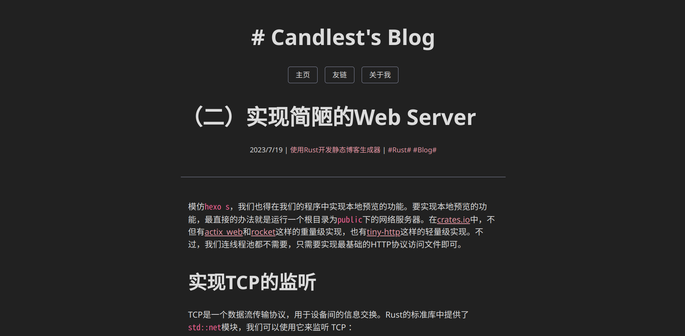

# README

- [README](#readme)
  
   * [about rublog](#about rublog)
   * [Demo DEMO](#Demo demo)
   * [installation](#installation)
   * [use](#use)
     + [Initialize from rublog-template](#Initialize from rublog-template)
     + [rublog command](#rublog command)
     + [publish page](#publish page)
   * [Development plan](#Development plan)
   * [TOML Front Matter](#toml-front-matter)
   * [related](#related)
   * [contributor](#contributor)
   * [License](#License)
   
   the Chinese version: [中文](./README/README_CN.md)

## About rublog

rublog` /rʌblɑg/` is a static blog generator written in `Rust`, which implements the following functions:

- Convert `markdown` to `html` via [pulldown cmark](https://github.com/raphlinus/pulldown-cmark)
- Use [toml-rs](https://github.com/toml-rs/toml) to implement article properties similar to `YAML Front Matter`, see [TOML Front Matter](#TOML Front Matter)
- Implement `html` template rendering of [Django template language](https://docs.djangoproject.com/en/3.1/topics/templates/) through [tera](https://github.com/Keats/tera)
- Currently using [web_server](https://github.com/Milesq/web_server) to preview the site (consider rewriting)

[View our development plan] (#development plan).

## demo DEMO

My blog: https://candlest.github.io/



## Install

Currently not packaged, it can be installed from source code.

> in the future ;-)

That is, get the source code from release or directly `git clone`, and use `cargo build --release` to compile. After the compilation is complete, add the binary file to the environment variable and use it from the command line. Here is an example for `linux`:

```bash
git clone https://github.com/Candlest/rublog.git
cd ./rublog
cargo build --release
sudo cp ./target/release/rublog /usr/bin/rublog
```

## use

### Initialize from rublog-template

We can initialize our project from [rublog-template](https://github.com/Candlest/rublog-template), please see its [README](https://github.com/Candlest/rublog-template/blob/main/README.md) for details, so I won’t go into details here.

```bash
git clone https://github.com/Candlest/rublog-template.git
```

### rublog command

The help list can be obtained through `rublog help` or `rublog`

Build the `/public` directory: `rublog build`

Clean up the `/public` directory: `rublog clear`

Run from the `/public` directory: `rublog run`

Lazy package: `clear`, `build`, `run` in one go: `rublog cbr`

> If you have used `hexo`, then `rublog` is very easy to use, because the `rublog` command is inspired by `hexo`.

### Publishing the web page

The `/public` directory is the root directory of the generated website, just upload it.

> This design is also inspired by `hexo`.

## Development Plan

> Since Candlest is preparing for the Chinese college entrance examination in 2024, the development progress is likely to be delayed.

`TOML Front Matter` related:

- [ ] `TOML Front Matter` default handling
- [ ] More `TOML Front Matter`
- [ ] Generate default `TOML Front Matter` via command line arguments
- [ ] Sort articles by `TOML Front Matter`, and index articles by tags

Plugins and Extensibility:

- [ ] Use `config.toml` to manage webpage related parameters
- [ ] Build a plugin management system and use the plugin management system to add `gitalk`, `highlight.js`, etc.
- [ ] Build a theme management system and create default themes

Code related:

- [ ] Seriously write error handling instead of `unwarp()`.
- [ ] Write a server implementation that can meet the needs of the blog, or find a library that is both lightweight and high-performance
- [ ] Organize projects and learn the project format of [crates.io](https://crates.io)

Documentation related:

- [ ] Generate list of contributors using GitHub Action
- [ ] Disassemble README

## TOML Front Matter

Currently, there are two `TOML Front Matter` formats: Post and Page.

```rust
#[derive(Serialize, Deserialize, Debug)]
pub struct Post {
     title: String,
     datetime: Datetime,
     tags: Vec<String>,
     category: String,
}
#[derive(Serialize, Deserialize, Debug)]
pub struct Page {
     title: String,
}
```

We can set the properties of the `markdown` document through `TOML Front Matter` and access them through the `tera` templating language.

## relevant

- [ONEPAGE](https://github.com/hanpei/onepage) gave me great inspiration, especially the part of rendering templates.
- [Hexo](https://github.com/hexojs/hexo), as a static blog generator with both scalability and ease of use, cultivated my user habits and gave me inspiration for command line design.
- I refer to a lot of information on the Internet, and I will explain the main parts in my [Development Record](https://www.zhihu.com/column/c_1664617254036639745).

## Contributors

[@Candlest](https://github.com/Candlest)

Any contributions are welcome!

## license

This project uses **MIT License** open source.
