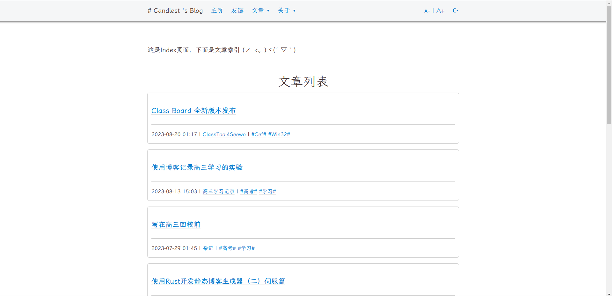

<div align="center">
  
  <p><strong>Rigos: Rigos is a generator of sites, written in Rust</strong></p>

</div>

[中文](./README/README_CN.md)

# Overview

Rigos is a lightweight and high-speed single-file static site generator, written in Rust.
If you want to use Rigos, please ensure that you have read and understand the following information:

Advantages of Rigos:

- Lightweight single-file, avoiding cumbersome installation processes and environment variable configurations
- High performance, even faster than `hugo`

Disadvantages of Rigos:

- Currently lacks flexibility, with poor customizability





# TODO

- [] YAML Front Matter

# Installation

There is currently no packaging, installation can be done from the source code.

That is, obtain the source code from the release or directly `git clone`, and compile with `cargo build --release`. After compilation, add the binary file to the environment variable to use from the command line. Here is an example for Linux:

```bash
git clone https://github.com/Candlest/rigos.git
cd ./rigos
bash ./install.sh
```

For Windows systems, you can directly copy `target/release/rigos.exe` to `C:\Windows`

# Usage

You can use `rigos init` to create a new site.

You can get the help list through `rigos help`.

Render the `/pub` directory: `rigos render`

Preview from the `/pub` directory: `rigos preview`

Lazy command: `rigos rap`

> If you have used `hugo` before, `rigos` is easy to get started with, because the `rigos` command is inspired by `hugo`.

Deploy to remote git repo: `rigos deploy`

You can use `rigos new page "apage"` to create a new page (and you should register it to `config.toml`, so that minijinja can read it)

You can use `rigos new post "category/post"` to create a new post.

# Related

- [ONEPAGE](https://github.com/hanpei/onepage) has greatly inspired me, especially in the part of rendering templates.

- [Hexo](https://github.com/hexojs/hexo), as a static blog generator with both expandability and ease of use, has cultivated my user habits and inspired me in command line design.

- [Hugo](https://gohugo.io/), a static blog generator written in golang, with high performance.

- [minijinja](https://github.com/mitsuhiko/minijinja) is a powerful but minimal dependency template engine for Rust compatible with Jinja/Jinja2

# Contributors

[<a href="https://github.com/Candlest/rigos/graphs/contributors"></a>](https://github.com/Candlest)

Any contribution is welcome!

# License

This project is open source under the **MIT License**.
