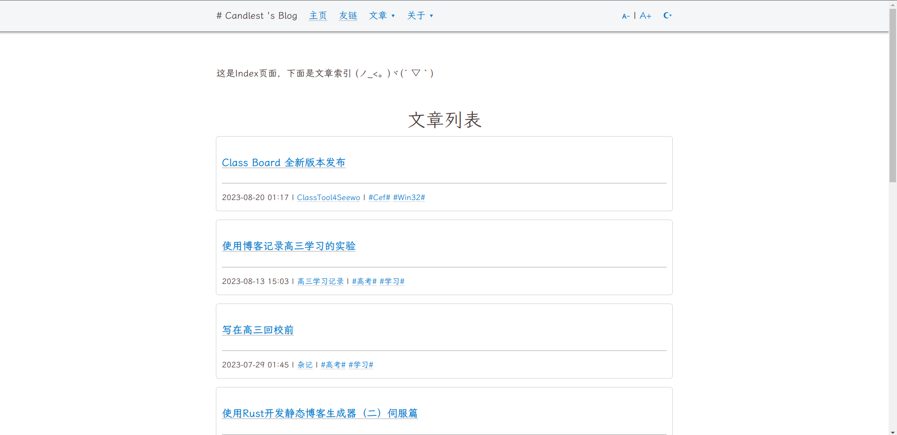

# rigos

> ⚠️ 这个项目仍在初期开发期，并且将经历重构，在1.0版本前不建议使用！！！

- [rigos](#rigos)
  - [关于rigos](#关于rigos)
  - [演示DEMO](#演示demo)
  - [安装](#安装)
  - [使用](#使用)
    - [rigos的命令](#rigos的命令)
    - [发布网页](#发布网页)
  - [开发计划](#开发计划)
  - [TOML Configs](#toml-configs)
    - [config.toml](#configtoml)
    - [TOML Front Matter](#toml-front-matter)
  - [相关](#相关)
  - [贡献者](#贡献者)
  - [许可证](#许可证)

## 关于rigos

rigos 是一个使用 `Rust` 编写的静态博客生成器，实现了以下功能：

- 通过 [pulldown cmark](https://github.com/raphlinus/pulldown-cmark) 将 `markdown` 转换为 `html`
- 使用 [toml-rs](https://github.com/toml-rs/toml) 实现了类似 `YAML Front Matter` 的文章属性
- 通过[tera](https://github.com/Keats/tera)实现类 [Django template language](https://docs.djangoproject.com/en/3.1/topics/templates/) 的`html`模板渲染
- 目前使用 [warp](https://github.com/seanmonstar/warp) 预览网站

[查看我们的开发计划](#开发计划)。

## 演示DEMO

我的博客：https://candlest.github.io




## 安装

目前暂时没有打包，可以从源代码安装。

> 以后会有 ;-)

即从release或者直接`git clone`获取源码，使用`cargo build --release`进行编译。编译完成后，将二进制文件加入环境变量，即可从命令行中使用。下面是一个适用于`linux`的例子：

```bash
git clone https://github.com/Candlest/rigos.git
cd ./rigos
cargo build --release
sudo cp ./target/release/rigos /usr/bin/rigos
```

## 使用

### rigos的命令

可以通过`rigos help`或者`rigos`获取帮助列表

构建`/public`目录：`rigos build`

清理`/public`目录：`rigos clear`

从`/public`目录运行：`rigos run`

懒人包：`clear`, `build`, `run`一气呵成：`rigos cbr`

> 如果你曾经使用过`hexo`，那么`rigos`是很容易上手的，因为`rigos`命令的灵感从`hexo`而来。

### 发布网页

`/public`目录即为被生成网站的根目录，上传即可。

## 开发计划

> 由于Candlest正在准备2024年的中国高考，开发进度大概率暂缓。

`TOML Front Matter` 相关：

- [ ] `TOML Front Matter` 缺省处理
- [x] 更多的 `TOML Front Matter`
- [ ] 通过命令行参数生成默认 `TOML Front Matter`
- [x] 通过 `TOML Front Matter` 为文章排序
- [x] 通过 `tags`, `category` 索引文章

插件与可拓展性：

- [x] 使用 `config.toml` 管理网页相关参数
- [ ] 构建一个插件管理系统，并使用插件管理系统添加 `gitalk`，`highlight.js` 等
- [x] 构建一个主题管理系统，并创建默认主题

代码相关：

- [ ] 认真地写错误处理，而不是 `unwarp()` 走天下
- [ ] 整理项目，学习 [crates.io](https://crates.io) 的项目格式

库相关：

- [ ] 自己写一个能够满足博客需求的server实现，或者找到兼具轻量与高性能的库
- [x] 使用 clap 库处理命令行参数

文档相关：

- [x] 生成贡献者列表
- [ ] 拆解README

## TOML Configs

### config.toml

在博客项目的根目录：

``` rust

    pub page_templates: Vec<String>,
    pub public_dir: String,
    pub source_dir: String,
    pub static_dir: String,
    pub page_dir: String,
    pub template_dir: String,
    pub theme: String,

```

### TOML Front Matter

```rust
pub struct HProperty {
    pub title: String,
    pub datetime: Datetime,
    pub tags: Vec<String>,
    pub category: String,
    pub url_name: String,
}
```

我们可以通过 `TOML Front Matter` 设置 `markdown` 文档的属性，通过 `tera` 模板语言访问它们。

## 相关

- [ONEPAGE](https://github.com/hanpei/onepage)极大地给予我灵感，尤其是渲染模板的部分。
- [Hexo](https://github.com/hexojs/hexo)作为一个兼具拓展性和易用性的静态博客生成器，培养了我的用户习惯，给予我在命令行设计上的灵感。
- 参考了很多互联网上的资料，在我的[开发记录](https://www.zhihu.com/column/c_1664617254036639745)中会说明其中的主要部分。

## 贡献者

[<a herf="https://github.com/Candlest/rigos/graphs/contributors"></a>](https://github.com/Candlest)

欢迎任何的贡献！

## 许可证

本项目使用 **MIT License** 开源。
