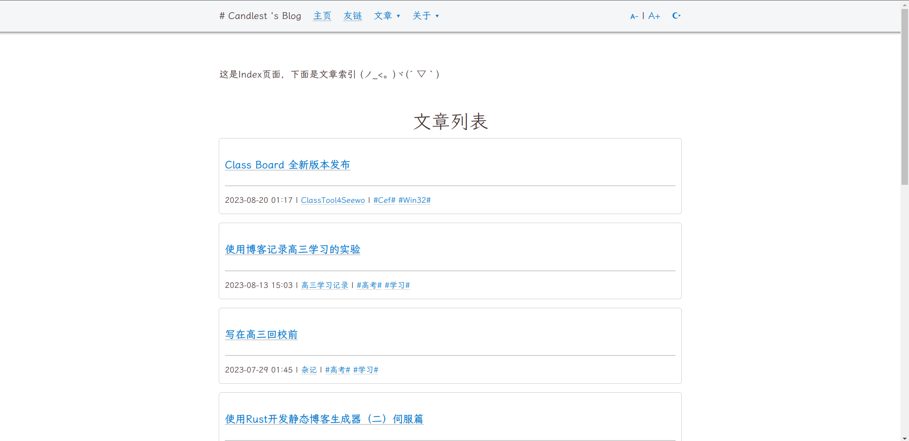
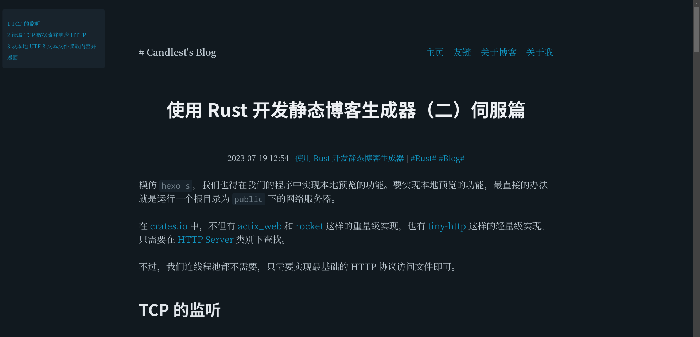

<div align="center">
  
  <p><strong>Rigos: Rigos is a generator of sites, written in Rust</strong></p>

</div>

# 概览

Rigos 是一个轻量级、高速的单文件静态网站生成器，用 Rust 编写。
如果您想使用 Rigos，请确保您已经阅读并理解了以下信息：

Rigos 的优点：

- 轻量级单文件，避免了繁琐的安装过程和环境变量配置
- 高性能，甚至比 `hugo` 还要快

Rigos 的缺点：

- 目前缺乏灵活性，可定制性较差




# 安装

目前还没有打包，可以从源代码安装。

也就是说，从发布版本获取源代码或直接 `git clone`，然后使用 `cargo build --release` 编译。编译后，将二进制文件添加到环境变量以便从命令行使用。以下是 Linux 的示例：

```bash
git clone https://github.com/Candlest/rigos.git
cd ./rigos
bash ./install.sh
```

对于 Windows 系统，您可以直接将 `target/release/rigos.exe` 复制到 `C:\Windows`

# 使用方法

您可以使用 `rigos init` 创建一个新站点。

您可以通过 `rigos help` 获取帮助列表。

渲染 `/pub` 目录：`rigos render`

从 `/pub` 目录预览：`rigos preview`

懒惰命令：`rigos rap`

> 如果您之前使用过 `hugo`，那么 `rigos` 很容易上手，因为 `rigos` 命令的灵感来自 `hugo`。

部署到远程 git 仓库：`rigos deploy`

您可以使用 `rigos new page "apage"` 创建一个新页面（您应该将其注册到 `config.toml` 中，以便 minijinja 可以读取它）

您可以使用 `rigos new post "category/post"` 创建一篇新文章

# 相关

- [ONEPAGE](https://github.com/hanpei/onepage) 在渲染模板部分给了我很大的启发。

- [Hexo](https://github.com/hexojs/hexo)，作为一个具有可扩展性和易用性的静态博客生成器，培养了我的用户习惯，并在命令行设计上给了我灵感。

- [Hugo](https://gohugo.io/)，一个用 golang 编写的静态博客生成器，性能很高。

- [minijinja](https://github.com/mitsuhiko/minijinja) 是一个功能强大但依赖性最小的 Rust 模板引擎，与 Jinja/Jinja2 兼容

# 贡献者

[<a href="https://github.com/Candlest/rigos/graphs/contributors"></a>](https://github.com/Candlest)

欢迎任何的贡献！

# 许可证

本项目使用 **MIT License** 开源。
