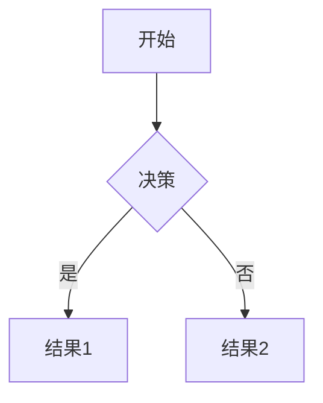

title="各插件测试"
filename="test"
date="2024-06-20T19:20:17"
tags=["测试"]
category="其他"
%%%%%%
### mermaid 绘图

### KATEX

<p>这是一个数学公式 \(E = mc^2\) 的例子。</p>

### Prism.js

```Rust
// 渲染 index.html
let template_index =
    read_template_file(format!("theme/{}/index.html", theme).as_str()).unwrap();
env.add_template("page", &template_index).unwrap();
let template_index = env.get_template("page").unwrap();
let content = io::read_file_contents("index.md").unwrap().to_string();
let content = markdown::to_html_with_options(
    &content.as_str(),
    &Options {
        compile: CompileOptions {
            allow_dangerous_html: true,
            allow_dangerous_protocol: true,
            ..CompileOptions::gfm()
        },
        ..Options::gfm()
    },
)
.unwrap();
```